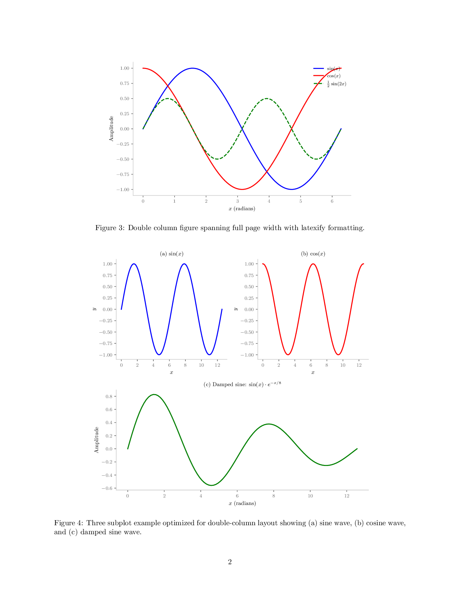

# Latexify

Professional matplotlib plots for LaTeX documents. Transform ugly default plots into publication-ready figures with just two lines of code.

**Built on the foundational work by [Jack Kelly](https://github.com/jackkelly)** and enhanced for modern research workflows. This package has been successfully used in multiple publications from our sustainability research lab.

## Why Latexify?

Default matplotlib produces plots that look amateur and clash with your beautiful LaTeX documents. Latexify fixes this by providing:

- **Font matching** - Uses same fonts as your document  
- **Proper sizing** - Automatic figure dimensions for single/double columns  
- **LaTeX symbols** - Perfect math rendering with `r'$\sin(x)$'`  
- **Clean axes** - Removes chart junk and visual clutter  
- **No scaling needed** - Just use `\includegraphics{plot.pdf}` directly  

## Visual Comparison

The difference is dramatic. Here's a complete LaTeX document showing default matplotlib vs. latexify:

### Page 1: Before vs. After


### Page 2: Double Column Layout  


### Page 3: Multiple Subplots & Code Examples


**Key improvements shown:**
- **Font matching**: Latexify plots use the same fonts as document text
- **Clean axes**: No chart junk, professional appearance  
- **LaTeX symbols**: Perfect math rendering with `$\sin(x)$`, `$\cos(x)$`
- **Proper sizing**: No manual scaling needed in `\includegraphics{}`
- **Column optimization**: Automatic sizing for single and double column layouts

## Installation

```bash
pip install git+https://github.com/sustainability-lab/latexify.git
```

Or copy `latexify.py` to your project.

## Quick Start

```python
import latexify
import matplotlib.pyplot as plt
import numpy as np

# Setup for your document
latexify.latexify(columns=1)  # or columns=2

# Plot with LaTeX symbols
x = np.linspace(0, 2*np.pi, 100)
plt.plot(x, np.sin(x), label=r'$\sin(x)$')
plt.plot(x, np.cos(x), label=r'$\cos(x)$') 
plt.xlabel(r'$x$ (radians)')
plt.ylabel(r'Amplitude')
plt.legend()

# Clean up and save
latexify.format_axes(plt.gca())
latexify.save_fig('plot.pdf')
```

In your LaTeX document:
```latex
\begin{figure}[htbp]
    \centering
    \includegraphics{plot.pdf}  % No width scaling needed!
    \caption{Beautiful, professional plot.}
\end{figure}
```

## Examples for Different Document Classes

### IEEE Conference Format


### ACM Proceedings Format  


### Beamer Presentations


Each example shows how latexify automatically adapts to different academic document formats with appropriate font sizes, spacing, and styling. The examples include:

- **Code snippets** with proper Python string quotes
- **3 subplot layouts** optimized for each format
- **Before/after comparisons** showing the improvement
- **Complete LaTeX source** for easy adaptation

## API Reference

### `latexify(columns=1, largeFonts=False, fig_width=None, fig_height=None)`
Configure matplotlib for LaTeX output.

**Parameters:**
- `columns`: 1 for single column, 2 for double column layouts
- `largeFonts`: `True` for presentations, `False` for papers  
- `fig_width/fig_height`: Override automatic sizing (inches)

### `format_axes(ax)`
Clean up axes by removing chart junk and applying professional styling.

### `save_fig(filename, **kwargs)`
Save figure with optimal settings for LaTeX inclusion.

## Document Class Specific Usage

### Standard Article
```python
latexify.latexify(columns=1)  # Single column
latexify.latexify(columns=2)  # Double column  
```

### IEEE Format
```python
latexify.latexify(fig_width=3.4, fig_height=2.3)
plt.rcParams.update({'font.size': 8})
```

### ACM Format  
```python
latexify.latexify(fig_width=3.3, fig_height=2.2)
plt.rcParams.update({'font.size': 9})
```

### Beamer Presentations
```python
latexify.latexify(largeFonts=True, fig_width=4.5, fig_height=3.0)
# Automatically uses larger fonts suitable for presentations
```

## Finding Column Width for Any Template

Need custom dimensions? Here's how to find your template's column width:

### Method 1: LaTeX Commands
Add this to your document and check the output:
```latex
\the\columnwidth     % Shows column width in points
\the\textwidth       % Shows text width in points
```

Convert points to inches: **width_inches = points / 72.27**

### Method 2: Ruler Package
```latex
\usepackage{ruler}
\begin{document}
\ruler  % Shows ruler with measurements
```

### Method 3: Common Templates
| Template | Single Column | Double Column |
|----------|---------------|---------------|
| Standard Article | 3.5" | 7.0" |
| IEEE | 3.4" | 7.0" |
| ACM | 3.3" | 6.75" |
| Springer | 3.35" | 6.8" |

Then use: `latexify.latexify(fig_width=YOUR_WIDTH)`

## Advanced Tips

### Custom Font Sizes
```python
latexify.latexify(columns=1)
plt.rcParams.update({
    'font.size': 9,           # Base font size
    'axes.labelsize': 9,      # Axis labels  
    'legend.fontsize': 8,     # Legend
    'xtick.labelsize': 8,     # Tick labels
    'ytick.labelsize': 8
})
```

### Multiple Plots
```python
fig, axes = plt.subplots(2, 2, figsize=(6.5, 5))
for ax in axes.flat:
    ax.plot(data)
    latexify.format_axes(ax)  # Clean each subplot
```

### Golden Ratio Sizing
Latexify automatically uses the golden ratio (≈1.618) for aesthetically pleasing proportions:
```python
# This gives you golden ratio height automatically
latexify.latexify(fig_width=3.5)  # height = 3.5/1.618 ≈ 2.16"
```

## Requirements

- matplotlib >= 3.0.0
- numpy >= 1.15.0  
- LaTeX installation (for math rendering)

## License

MIT